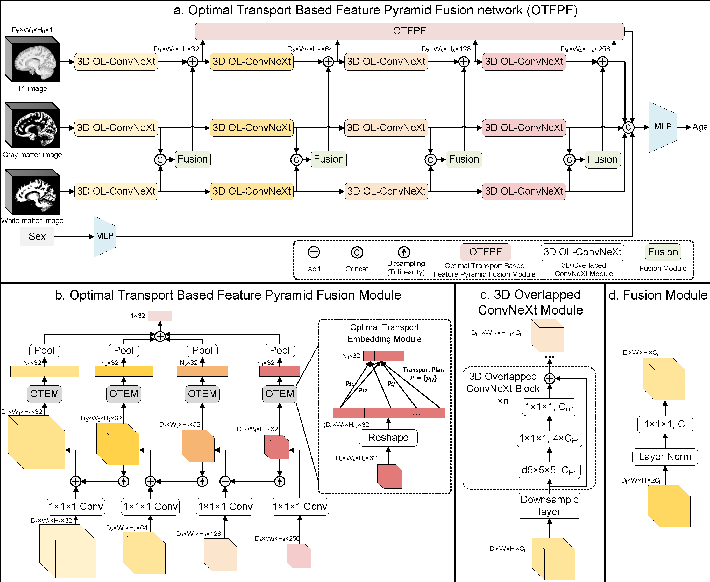

# OTFPF: Optimal Transport-Based Feature Pyramid Fusion Network for Brain Age Estimation with 3D Overlapped ConvNeXt
Optimal transport based feature pyramid fusion (OTFPF) network, an end-to-end neural network architecture for the brain age estimation with T1 MRIs.

## Framework

## Results

## Future works for pathological analyses based on OTFPF network

## Acknowledgment
This is the repository for our paper which was submitted to *The 25th International Conference on Medical Image Computing and Computer Assisted Intervention, MICCAI 2022*. And the code will be released after final desicision.
